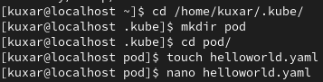
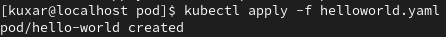
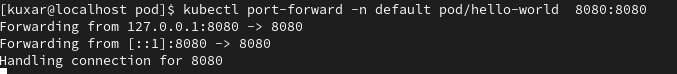
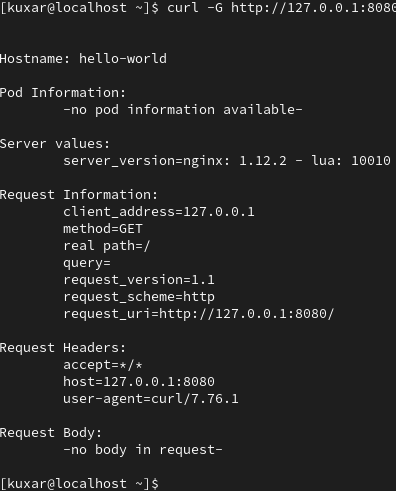
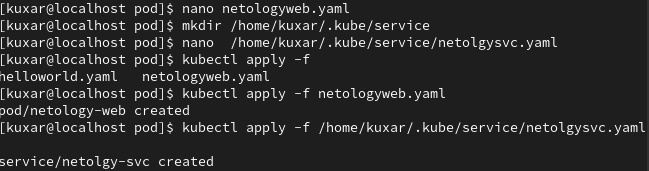
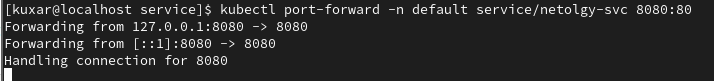
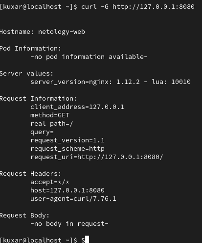
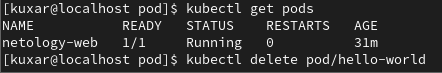

# kuber-02-basic

------

### Задание 1.

#### 1. Создал файл
   
   
   
```
apiVersion: v1
kind: Pod
metadata:
  name: hello-world
spec:
  containers:
  - name: echoserver
    image: gcr.io/kubernetes-e2e-test-images/echoserver:2.2
    ports:
    - containerPort: 8080
```
[helloworld.yaml](yaml/helloworld.yaml)
#### 2. Запуск "пода".
   


#### 3. Проброс портов

 Ввожу команду 

```
kubectl port-forward -n default pod/hello-world  8080:8080
```



#### Итоговый вывод curl




------

### Задание 2.

#### Создал новый под и сервис



[netolgysvc.yaml](yaml/netolgysvc.yaml)

[netologyweb.yaml](yaml/netologyweb.yaml)

#### Подключился и проверил




------

p.s

